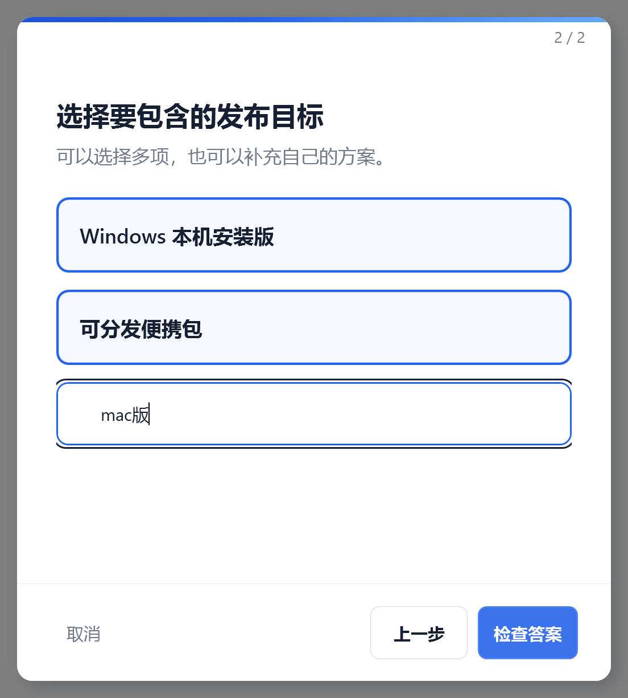
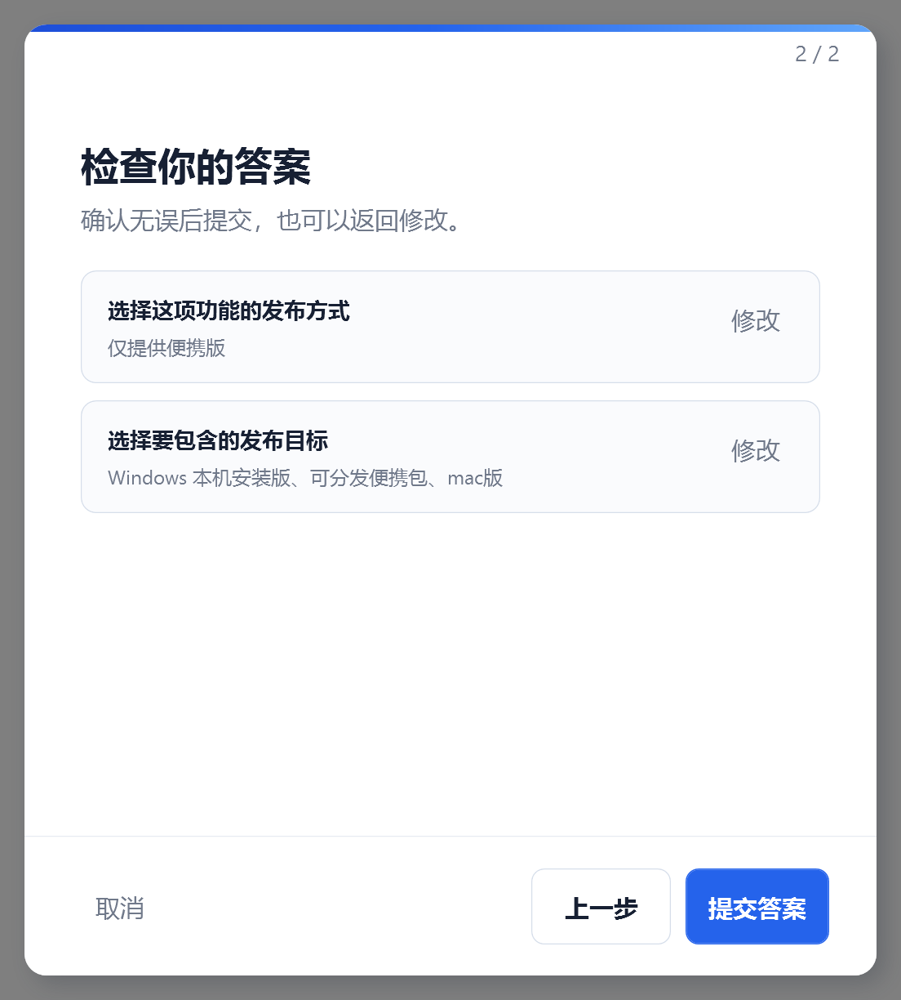

# Codex Cue for Windows

[简体中文](README.md) | [English](README.en.md)

Codex Cue is a lightweight native Windows wizard that lets Codex ask questions in a desktop window. Users can answer single-choice, multiple-choice, and open-ended questions with direct clicks or text input. Lifecycle hooks can automatically route questions to the desktop and offer two or three clickable next-task suggestions when work is complete.

## Preview

<p align="center">
  
</p>

<table>
  <tr>
    <td width="50%"></td>
    <td width="50%"></td>
  </tr>
  <tr>
    <td align="center">Multiple choice and free text</td>
    <td align="center">Review and edit before submission</td>
  </tr>
</table>

## Requirements

- Windows 10 22H2 (19045) or newer
- x64 system
- .NET Framework 4.8, normally included with Windows 10 and 11

## Install with the setup package (recommended)

1. Open the [Releases](https://github.com/binaryaoucstics-lang/codex-cue/releases) page and download `CodexCue-Setup-x64.exe` and `SHA256SUMS.txt`.
2. Optionally verify the download in PowerShell:

   ```powershell
   Get-FileHash .\CodexCue-Setup-x64.exe -Algorithm SHA256
   Get-Content .\SHA256SUMS.txt
   ```

   The SHA-256 values must match exactly.
3. Run `CodexCue-Setup-x64.exe`. It installs the app for the current user, registers the personal marketplace, enables the plugin, and backs up an existing installation.
4. In Codex CLI, enter `/hooks`. Find the `SessionStart`, `UserPromptSubmit`, and `Stop` hooks provided by `codex-cue`, verify that they point to `CodexCue.exe`, then trust and enable them. In the Codex desktop app, open **Settings → Coding → Hooks** and trust the Codex Cue hooks.
5. Close any Codex tasks that were open before installation and create a new task. Existing tasks do not reload Skills, MCP servers, or hooks while running.
6. Verify the installation:

   ```powershell
   codex plugin list
   codex mcp list
   Get-CimInstance Win32_Process -Filter "Name='CodexCue.exe'" |
     Select-Object ProcessId, ExecutablePath, CommandLine
   ```

   Expected results:

   - `codex-cue@personal` is `installed, enabled`.
   - The `codex_cue` MCP server is `enabled`.
   - At least one `CodexCue.exe --host` process is running.

The installer starts a separate desktop host and registers it for the current user's login. Question and option text travels through MCP stdio JSON and named pipes; it is not transported through PowerShell, temporary files, or the clipboard.

The installer is currently unsigned, so Windows SmartScreen may show an unknown-publisher warning. Verify `SHA256SUMS.txt` before choosing **More info → Run anyway**.

## Portable installation

Download `CodexCue-portable-x64.zip`, verify its hash, extract it, then run:

```powershell
.\CodexCue.exe --install-plugin
```

Trust the hooks and create a new Codex task as described above. For MCP-only integration, run `plugins\codex-cue\bin\CodexCue.exe --mcp`; no background HTTP service is required.

## Upgrade and uninstall

- Upgrade by running the latest installer. It creates a timestamped backup and SHA-256 manifest before replacing managed files.
- Uninstall **Codex Cue** from **Windows Settings → Apps → Installed apps**. The uninstaller removes the login startup entry and safely restores the pre-installation backup when applicable.
- Codex may ask you to review and trust hooks again when a release changes their definitions.
- Upgrading from Codex Option Prompts is supported: the installer migrates the old plugin identity, MCP approval settings, startup entry, plugin directory, and local data.

## MCP tool

### Tray settings and completion suggestions

Right-click the Codex Cue checkmark in the Windows notification area and select **Settings** to enable or disable completion suggestions and choose between 1 and 6 options per completion. **Skip next completion suggestion** is consumed once and then resets automatically. The next-step wizard also exposes an explicit **Skip** action and will not ask again for the same completion.

`ask_options` accepts any number of questions and options. Each question supports `single`, `multiple`, and `allowOther`:

```json
{
  "questions": [
    {
      "id": "publish",
      "prompt": "Choose a distribution method",
      "mode": "single",
      "required": true,
      "allowOther": true,
      "options": [
        { "id": "installer", "label": "Installer", "recommended": true },
        { "id": "portable", "label": "Portable package" }
      ]
    }
  ],
  "reviewMode": "auto",
  "maxWaitMs": 900000
}
```

Results use the `submitted`, `cancelled`, or `timed_out` status. Successful results return ordered `answers` and identify `source: desktop-wpf`. `option_prompt_status` reports only the version and queue counts and never exposes prompt or answer text.

## Build and test

Development requires PowerShell 5.1, Python, Git, and MSBuild. Packaging uses a pinned Inno Setup 6.7.3 toolchain.

```powershell
powershell -ExecutionPolicy Bypass -File .\scripts\test.ps1
powershell -ExecutionPolicy Bypass -File .\scripts\package.ps1
powershell -ExecutionPolicy Bypass -File .\scripts\e2e.ps1 -ArtifactRoot .\artifacts\staging
powershell -ExecutionPolicy Bypass -File .\tests\PackageTests.ps1
```

Both distributable packages are required to remain under 5,000,000 bytes.

## Troubleshooting

- **No prompt window:** create a new Codex task, run `codex mcp list`, confirm `codex_cue` is enabled, and check for a `CodexCue.exe --host` process.
- **Plugin disabled:** run `codex plugin add codex-cue@personal`, then create a new task.
- **Host not responding:** end `CodexCue.exe` in Task Manager. The next MCP call restarts it automatically.
- **Installation problem:** inspect `%LOCALAPPDATA%\CodexCue\install-status.json`; previous files remain under the adjacent `backups` directory.

## License

Codex Cue is licensed under the [Apache License 2.0](LICENSE) and includes a [NOTICE](NOTICE) attribution file. Applicable copyright, license, attribution, and modification notices must be retained when redistributing the project.
